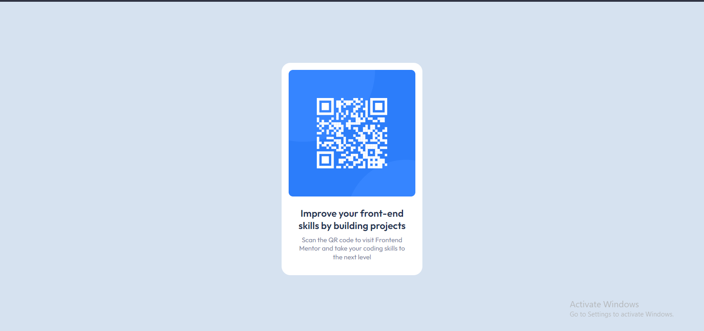

# Frontend Mentor - QR code component solution

This is a solution to the [QR code component challenge on Frontend Mentor](https://www.frontendmentor.io/challenges/qr-code-component-iux_sIO_H). Frontend Mentor challenges help you improve your coding skills by building realistic projects. 

## Table of contents

- [Overview](#overview)
  - [Screenshot](#screenshot)
  - [Links](#links)
- [My process](#my-process)
  - [Built with](#built-with)
  - [What I learned](#what-i-learned)
  - [Continued development](#continued-development)
- [Author](#author)

## Overview

### Screenshot



### Links

- [Github repo](https://github.com/OU-ZAA/qr-code-component-main)
- [Live Site](https://ou-zaa.github.io/qr-code-component-main/)

## My process

### Built with

- Semantic HTML5 markup
- CSS custom properties
- CSS Grid

### What I learned

-Learnt how to use sturctured and semantic HTML

```html
  <main>
    <article class="card">
      
      <p class="card-heading">
        Improve your front-end skills by building projects
      </p>
      <p class="card-description">
        Scan the QR code to visit Frontend Mentor and take your coding skills to the next level
      </p>
    </article>
  </main>
```
-Learnt how to center an element with CSS grid

```css
main {
  display: grid;
  place-items: center;
}
```
-Learnt how to add space between elements with margin property

### Continued development

-I want to fully understand how to structure HTML elements and use semantic HTML and get my hands on how to use CSS layout 

## Author

- Github - [Mohammed Ou-zaa](https://github.com/OU-ZAA/)
- Frontend Mentor - [@OU-ZAA](https://www.frontendmentor.io/profile/OU-ZAA)
- Twitter - [@Kurtthedev](https://www.twitter.com/yourusername)
